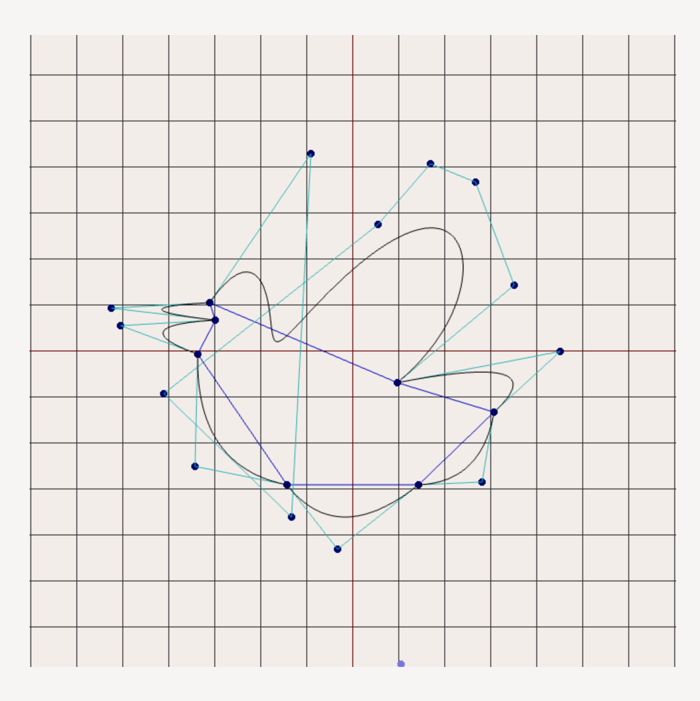

# パラメトリック曲線

タエチャスク ナッチャノン 05241011

## はじめに

本稿は東京大学コンピュータグラフィックス論の課題として日本語で記述するものである。
Glitchでの実装はコード周りの記述に不便な点があるため、個人のブログに記載することとした。
外部の方にも役立つ内容であることを期待する。

本稿では、コンピュータグラフィックスにおける基礎的な要素の一つ、パラメトリック曲線について説明する。

## そもそも「パラメトリック」とは

よく見慣れている曲線の表現は $y = f(x)$ という形で表されるものが多い。
例えば、$y = x^2$ や $y = \sin(x)$ などである。

それに対して、$y$ が $x$ の値に（明示的に）依存せず、$y$ と $x$ が両方ともパラメタ $t$ に依存するような曲線をパラメトリック曲線と呼ぶ。
例えば、円の方程式は次のように表される。

```math
\begin{align*}
x &= r \cos(t) \\
y &= r \sin(t)
\end{align*}
```

## 軸の描画

`matplotlib` と​ `numpy` を使ったことがあるならば、
`np.linspace(0, 1, 100)` のような関数を用い、頂点をサンプリングし、線分を描画することが見慣れているだろう。

WebGL も同様に、頂点のサンプリングを行って線分を繋いで描画することができる。

`arange` と `linspace` の具体的な実装を省略する。

```ts
const axes = [-1, 0, 1, 0, 0, -1, 0, 1];
```

を定義する。

WebGL は基本的に Vertex Shader と Fragment Shader の二つのシェーダーを用いて描画を行う。Vertex Shader では、頂点の座標を受け取り、Fragment Shader では、その頂点の領域に色を付ける。

今回で扱うのは、渡した頂点をそのまま描画するだけのシェーダーである。

```glsl
#version 300 es
in vec2 a_position;

void main() {
    gl_Position = vec4(a_position, 0.0, 1.0);
}
```

色も同様だが、uniform (自分の認識ではレンダーループの中で設定可能なもの) として受け取るようにする。

```glsl
#version 300 es
precision mediump float;
out vec4 fragColor;
uniform vec4 uColor;

void main() {
    fragColor = uColor;
}
```

すると、シェーダーをコンパイルし、プログラムを作成する。(ヘルパー関数は省略)

```ts
const vertexShader = compileShader(gl, gl.VERTEX_SHADER, vertexShaderSource);
const fragmentShader = compileShader(gl, gl.FRAGMENT_SHADER, fragmentShaderSource);
const program = createProgram(gl, vertexShader, fragmentShader);
```

次に、頂点をバッファに格納する。

```ts
gl.useProgram(program);
const buffer = gl.createBuffer();
gl.bindBuffer(gl.ARRAY_BUFFER, buffer);
gl.bufferData(gl.ARRAY_BUFFER, new Float32Array(axes), gl.STATIC_DRAW);
```

頂点の位置を指定するために、`gl.getAttribLocation` を用いて、シェーダーの中で `a_position` として定義した変数の位置を取得する。また、`gl.getUniformLocation` を用いて、uniform 変数の位置を取得する。

```ts
const posLocation = gl.getAttribLocation(program, "a_position");
const uColorLoc = gl.getUniformLocation(program, "uColor");
```

次に、レンダーループの中で、

```ts
gl.useProgram(program);
gl.bindBuffer(gl.ARRAY_BUFFER, curveBuffer);

// 頂点の位置を指定
gl.enableVertexAttribArray(posLocation);
gl.vertexAttribPointer(posLocation, 2, gl.FLOAT, false, 0, 0);

// uniform 変数の位置を取得
gl.uniform4f(uColorLoc, 0.4, 0.0, 0.0, 1.0);
gl.drawArrays(gl.LINES, 0, 4); // 4つの頂点を描画
```

<div id="show-axes" class="sd" />

以上より、座標軸を描画することができる。

## 簡単な曲線の描画

次に、円を描画する。円の頂点も同様に線分から形成されるため、`allVertices` にまとめる。
円の方程式から、$\theta$ を $0$ から $2\pi$ まで変化させることで、$x = r \cos(\theta)$, $y = r \sin(\theta)$ の頂点を得ることができる。ここで $r = 0.5$ とする。

```ts
const circle = linspace(0, 2 * Math.PI, 100).flatMap((theta) => [
  0.5 * Math.cos(theta),
  0.5 * Math.sin(theta),
]);

const allVertices = [...axes, ...circle];

// 以下は上記と同様

gl.useProgram(program);
const curveBuffer = gl.createBuffer();
gl.bindBuffer(gl.ARRAY_BUFFER, curveBuffer);
gl.bufferData(gl.ARRAY_BUFFER, new Float32Array(allVertices), gl.STATIC_DRAW);
```

レンダーループの中で、uniform 変数の位置を取得し、色を指定する。

```ts
gl.useProgram(curveProgram);
gl.bindBuffer(gl.ARRAY_BUFFER, curveBuffer);
gl.enableVertexAttribArray(curvePosLocation);
gl.vertexAttribPointer(curvePosLocation, 2, gl.FLOAT, false, 0, 0);
gl.uniform4f(uColorLoc_curve, 0.0, 0.4, 0.0, 1.0);
gl.drawArrays(gl.LINE_LOOP, 4, circle.length / 2);
```

<div id="show-circle" class="sd" />

ということで、円を描画することができる。

ただし、画面をリサイズしたりすると、描画が崩れてしまうため、`scaleMatrix` を用いて、描画を行う。

```glsl
#version 300 es

in vec2 a_position;
uniform mat4 u_scaleMatrix; // NEW

void main() {
    gl_Position = u_scaleMatrix * vec4(a_position, 0.0, 1.0); // NEW
}
```

最後に、`u_scaleMatrix` を uniform 変数として受け取り、`gl_Position` に掛け算を行う。

```ts
const aspectRatio = displayWidth / displayHeight;
const worldToGLScale = (PITCH * 2) / displayWidth;
const aspectScaleMatrix = glm.mat4.create();
glm.mat4.identity(aspectScaleMatrix);
glm.mat4.scale(aspectScaleMatrix, aspectScaleMatrix, [
  worldToGLScale,
  worldToGLScale * aspectRatio,
  1,
]);

// 軸を描画するためには、-1 から 1 の範囲に収める必要があるため、identityMatrix を用意する。
const identityMatrix = glm.mat4.create();
glm.mat4.identity(identityMatrix);
```

以下の `scrollPassed` は scroll の位置に応じて、描画を行うための関数である。この記事に特化した機能であるため、描画の本質には関係ない。

```ts
if (scrollPassed("show-axes")) {
  gl.useProgram(curveProgram);
  gl.bindBuffer(gl.ARRAY_BUFFER, curveBuffer);
  gl.enableVertexAttribArray(curvePosLocation);
  gl.vertexAttribPointer(curvePosLocation, 2, gl.FLOAT, false, 0, 0);
  gl.uniformMatrix4fv(uScaleMatrixLoc, false, identity);
  gl.uniform4f(uColorLoc_curve, 0.4, 0.0, 0.0, 1.0);
  gl.drawArrays(gl.LINES, 0, 4);
}

if (scrollPassed("show-circle")) {
  gl.useProgram(curveProgram);
  gl.bindBuffer(gl.ARRAY_BUFFER, curveBuffer);
  gl.enableVertexAttribArray(curvePosLocation);
  gl.vertexAttribPointer(curvePosLocation, 2, gl.FLOAT, false, 0, 0);
  gl.uniform4f(uColorLoc_curve, 0.0, 0.4, 0.0, 1.0);
  gl.uniformMatrix4fv(uScaleMatrixLoc, false, aspectScaleMatrix);
  gl.drawArrays(gl.LINE_LOOP, 4, circle.length / 2);
}
```

## ペンツール

本課題の工夫として、ペンツールを実装する。

### まずは、頂点から実装してみよう。

1. マウスの `EventListener` を登録する
2. 頂点を格納するための配列を用意する
3. 頂点を描画する

ただし、これまでの描画は、頂点が事前に決まっており、STATIC_DRAW で描画していたが、今回は、頂点が動的に変化するため、どうすべきだろうか。

WebGL では、これまで使っていた `gl.bufferData` というバッファの管理を行う関数の他に、`gl.bufferSubData` という関数もある。

<div class="sd" id="show-points" />

まずは、頂点を描画するためのシェーダーを用意する。

```glsl
#version 300 es
in vec2 a_position;
uniform mat4 u_scaleMatrix;

void main() {
    gl_Position = u_scaleMatrix * vec4(a_position, 0.0, 1.0);
    gl_PointSize = 8.0;
}
```

```glsl
#version 300 es
precision mediump float;
out vec4 fragColor;
uniform vec4 u_color;

void main() {
    float dist = length(gl_PointCoord - vec2(0.5, 0.5));
    if (dist < 0.5) {
        fragColor = u_color;
    } else {
        discard;
    }
}
```

次に、頂点を格納するための配列を用意する。

```ts
const vertices = useRef<glm.vec2[]>([]);
```

React を使っているため、`useRef` を用いることにした。

`pointProgram` の作成段階を省略し、`bufferData` の部分を見てみる。

```ts
const MAX_POINTS = 1000;
const pointBuffer = gl.createBuffer();
gl.bindBuffer(gl.ARRAY_BUFFER, pointBuffer);
gl.bufferData(
  gl.ARRAY_BUFFER,
  new Float32Array(MAX_POINTS * 2),
  gl.DYNAMIC_DRAW, // <- Use DYNAMIC_DRAW for dynamic data
);
```

以上は `MAX_POINTS` を定義し、`DYNAMIC_DRAW` を指定することで、動的に変化するデータを格納することができる。

`render` ループの中で、`gl.bufferSubData` を用いて、頂点を格納する。

```ts
if (scrollPassed("show-points")) {
  gl.useProgram(pointProgram);
  gl.bindBuffer(gl.ARRAY_BUFFER, pointBuffer);
  gl.enableVertexAttribArray(pointPosLocation);
  gl.vertexAttribPointer(pointPosLocation, 2, gl.FLOAT, false, 0, 0);
  gl.uniform4f(uColorLoc_point, 0.0, 0.0, 0.4, 1.0);

  if (vertices.current.length > 0) {
    gl.bufferSubData(
      gl.ARRAY_BUFFER,
      0,
      new Float32Array(vertices.current.flatMap((v) => [v[0], v[1]])),
    );
  }

  gl.uniformMatrix4fv(uScaleMatrixLoc_point, false, aspectScaleMatrix);
  gl.drawArrays(gl.POINTS, 0, vertices.current.length);
}
```

次に、`mouse` の `EventListener` を登録する。

```ts
function mouseDownHandler(e: MouseEvent) {
  if (!canvasRef.current) return;
  const [worldX, worldY] = screenToWorld(e.clientX, e.clientY, canvasRef.current, PITCH);
  vertices.current.push(glm.vec2.fromValues(worldX, worldY));
}
```

### ポイントの移動

次に、頂点の十分に近くをクリックしたときに、頂点を選択できるようにする。

```ts
const mouseState = useRef<MouseState>({
  x: 0,
  y: 0,
  isDown: false,
  intersect: undefined,
  picked: undefined,
});
```

`MouseState` は、マウスの状態を管理するための型である。`intersect` は、頂点の 0.2 単位以内にマウスがあるときに、頂点を選択するためのものである。`picked` は、`intersect` の頂点を `picked` に格納するためのものである。それ以外 (picked でも、intersect でもない) には、マウスをクリックすると頂点が追加することになる。つまり、有限状態機械のようなものになる。

### ポイントの選択

もっと複雑にすると、頂点をクリックしたとき洗濯中の状態にする。

```ts
const mouseState = useRef<MouseState>({
  x: 0,
  y: 0,
  isDown: false,
  intersect: undefined,
  picked: undefined,
  selected: undefined, // NEW
});
```

さらに頂点を削除できるように keyboard の `EventListener` を登録する。

```ts
function keydownHandler(e: KeyboardEvent) {
  if (e.key === "Escape") {
    mouseState.current.selected = undefined;
  }
  if (e.key === "Delete" || e.key === "Backspace") {
    if (mouseState.current.selected !== undefined) {
      vertices.current.splice(mouseState.current.selected, 1);
      mouseState.current.selected = undefined;
    }
  }
}
```

### マウスのスナップ

グリッドの近くに `shift` を押しながらマウスを動かすと、スナップするようにする。

```ts
type MouseState = {
  x: number;
  y: number;
  isDown: boolean;
  picked: number | undefined;
  intersect: number | undefined;
  selected: number | undefined;
  shouldSnap: boolean; // NEW
};
```

すでに world 座標に変換しているので、`Math.round` を用いて、スナップするようにする。

```ts
if (mouseState.current.shouldSnap) {
  const x = Math.round(worldX);
  const y = Math.round(worldY);
  mouseState.current.x = x;
  mouseState.current.y = y;
} else {
  mouseState.current.x = worldX;
  mouseState.current.y = worldY;
}
```

### ペンの状態機械

普通の直線ならば

1. `selected` の点があるときに、別の点をクリックすると線が描画される
2. `selected` の点があるときに、何もないところをクリックすると頂点が追加され、線が描画される

<div id="show-line" class="sd" />

つないだ線は `lines` に格納する。

```ts
const lines = useRef<[number, number][]>([]);
```

レンダーループの中で、`lines` を描画する。

```ts
if (lines.current.length > 0) {
  const allLines = lines.current.flatMap((line) => {
    const start = vertices.current[line[0]];
    const end = vertices.current[line[1]];
    return [start[0], start[1], end[0], end[1]];
  });

  gl.bufferSubData(gl.ARRAY_BUFFER, 0, new Float32Array(allLines));
  gl.drawArrays(gl.LINES, 0, allLines.length / 2);
}
```

### コントロールポイントの追加

ついに、本課題（ベージェ曲線）の本題に入る。

1. 線からの距離が threshold 以下のときに、線を選択するようにする。
2. 点を追加すると、`vertices` に格納し、対応する `lines` に格納する。
3. 削除の際に、`lines` からも削除する。

## 大きなリファクタリング

### class での実装

```ts
interface Vertex {
  coords: [number, number];
  isControlPoint: boolean;
  relatedLines: Set<number>;
  isNear(point: [number, number], threshold: number): boolean;
}

interface Line {
  start: number;
  end: number;
  addVertexAt: (vertex: Vertex, index: number) => void;
  isNear(point: [number, number], threshold: number): boolean;
  nearestSegmentIndex: (point: [number, number], threshold: number, vertexMap: VertexMap) => number;
}
```

を作成し、`Vertex` と `Line` の intersection 確認を抽象化する。

### Map の Wrapper

```ts
interface VertexMap {
  items: Map<number, Vertex>;
  nextId: number;

  add(coords: [number, number], isControlPoint?: boolean): number;
  delete(id: number, lineMap: LineMap): void;
  get(id: number): Vertex | undefined;
  set(id: number, vertex: Vertex): void;
  entries(): IterableIterator<[number, Vertex]>;
  size: number;
}

interface LineMap {
  items: Map<number, Line>;
  nextId: number;

  add(start: number, end: number): number;
  delete(id: number): void;
  get(id: number): Line | undefined;
  entries(): IterableIterator<[number, Line]>;
  size: number;
}
```

これらのインターフェースは `item` を追加・削除の際に、次の `id` を管理するためのものである。元々使っていた配列は削除すると全部ずれるため、`Map` を用いることにした。

<div class="sd" id="show-bezier" />

## n-次ベージェ曲線

次に、n-次ベージェ曲線を描画する。

```ts
class Line {
  allVerticesRef: RefObject<VertexMap>;
  vertices: number[];
  cached: [number, number][] | undefined;

  constructor(vertices: number[], allVerticesRef: RefObject<VertexMap>) {
    this.vertices = vertices;
    this.allVerticesRef = allVerticesRef;
  }

  getOrCompute() {
    if (this.cached) {
      return this.cached;
    }
    const computed = this.compute();
    this.cached = computed;
    return computed;
  }

  compute(): [number, number][] {
    const v = this.allVerticesRef.current;

    const vec = this.vertices.map((s) =>
      // biome-ignore lint/style/noNonNullAssertion: <explanation>
      glm.vec2.fromValues(...v.get(s)!.coords),
    );

    if (vec.length === 2) {
      return vec.map((v) => [v[0], v[1]]) as [number, number][];
    }

    const T = 100;
    const N = vec.length - 1;
    const ts = linspace(0, 1, T);

    const result = ts.map((t) => {
      const res = glm.vec2.create();
      for (let i = 0; i <= N; i++) {
        const coefficient = comb(N, i) * t ** i * (1 - t) ** (N - i);
        glm.vec2.scaleAndAdd(res, res, vec[i], coefficient);
      }
      return [res[0], res[1]];
    });

    return result as [number, number][];
  }

  invalidate() {
    this.cached = undefined;
  }
}
```

べージェ曲線のための計算量が重いため、各線ごとにキャッシュを用意する。

`compute` が本題であるため、より詳細に説明する。

まずは、`vertices` を glm のベクトル化して、長さが 2 であれば、そのまま返せばいい。

次に、一定の間隔で $t$ をサンプリングし、ベージェ曲線の方程式を用いて、各点を計算する。

サンプリングは自作​ `linspace` を用いることにした。

```ts
function linspace(start: number, end: number, num: number) {
  return Array.from({ length: num }, (_, i) => start + (end - start) * (i / (num - 1)));
}
```

もちろん、`comb` の実装でもキャッシュを用意する。

```ts
const combCache = new Map<[number, number], number>();
function comb(n: number, r: number): number {
  const cached = combCache.get([n, r]);
  if (cached) return cached;
  if (r === 0) return 1;
  if (r === 1) return n;
  if (r > n / 2) return comb(n, n - r);
  const res = Math.floor((n * comb(n - 1, r - 1)) / r);
  combCache.set([n, r], res);
  return res;
}
```

次にサンプリングをした `ts` を `map` して、`const coefficient = comb(N, i) * t ** i * (1 - t) ** (N - i)` で計算された係数で重み付け和を取る。

描画の方は簡単に

```ts
for (const [idx, line] of lines.current.items) {
  const segments = line.getOrCompute();

  gl.bindBuffer(gl.ARRAY_BUFFER, curveBuffer);
  gl.bufferData(gl.ARRAY_BUFFER, new Float32Array(segments.flat()), gl.STATIC_DRAW);
  gl.enableVertexAttribArray(curvePosLocation);
  gl.vertexAttribPointer(curvePosLocation, 2, gl.FLOAT, false, 0, 0);
  gl.uniform4f(uColorLoc_curve, 0.0, 0.0, 0.0, 1.0);
  gl.drawArrays(gl.LINE_STRIP, 0, segments.flat().length / 2);
}
```

以上より、n-次ベージェ曲線のペンツールを実装することができた。

## 今後の改善点・工夫点

WebGL についてより詳しく知りたかったため、スクラッチから実装してみたが、理想的でないコードを書いてしまったかもしれない。

特に気になったのは render ループごとにバッファデータを動的に登録して描画することである。

また、UX 的にいうと、点を移動することができたり、できなくなったりことがあるので、それを踏まえて状態機械を見直すべきである。

最後に頂点を `PITCH` 倍ほど掛けて interpolation を計算認め、数値的安定性に関しては特に影響がみえなかった。より小さい World 座標で計算を行うとより複雑なサンプリング方法が必要である。

## 結果

こんな結果が得られた。


