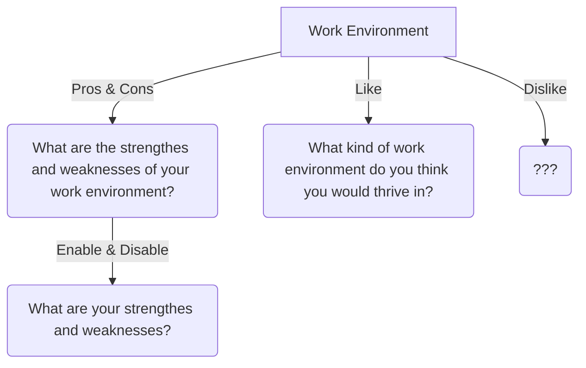
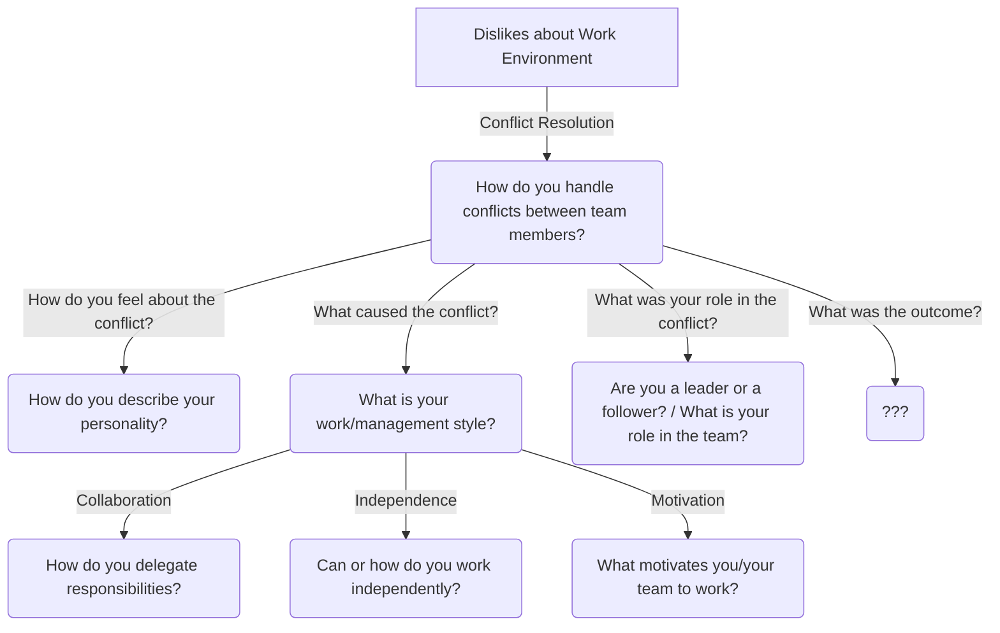
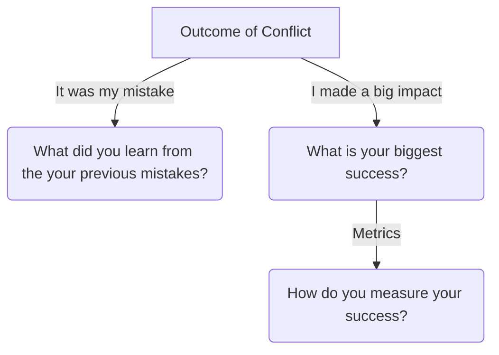

## Watch these two responses

> What's your greatest weakness?

One of my weaknesses is that I tend to over-engineer solutions. One time, I spent optimizing the Suspense boundary for RSC to make it stream content without utilizing any JavaScript. **I could have just used Tanstack Query and it would have been fine, but I wanted to prove that I could ship this page without any JavaScript. In the end, it took me a week to get it working. From now, I try to focus on "done" instead of "perfect".**

> What is your greatest strength?

One of my greatest strengths is my attention to detail. I once spent a week optimizing the Suspense boundary for RSC to make it stream content without utilizing any JavaScript. **This helps reduced the bundle size and improved the performance of the application. I take pride in my ability to find and fix small issues that can have a big impact on the overall quality of the code.**

## Your weakness is your strength. Your strength is your weakness.

After landing the job, I would like to share the technique I used to prepare for the final round of the interview with the manager. At first, I checked [35 interview questions for managers](https://www.indeed.com/career-advice/interviewing/interview-questions-for-managers) and was overwhelmed by the number of questions and how much I needed to prepared. But then I realized... **some of these questions do actually overlap!**

Let's go back to the two responses. This is a classic example of the "Double-Edged Sword" technique. Your weakness is your strength. Your strength is your weakness. You can use the same story to answer both questions. This might seem like an obvious technique, but maybe you might have some non-trivial strengths and weaknesses. Here are some non-exhaustive examples I have compiled:

| Weakness                         | Strength                                        |
| -------------------------------- | ----------------------------------------------- |
| I am not good at public speaking | I am good at writing documentation              |
| I am not good at asking for help | I am very independent and self-sufficient       |
| I get distracted easily          | I am very curious and like to explore           |
| I am not good at time management | I am flexible and can adapt to schedule changes |

| Strength                                     | Weakness                                      |
| -------------------------------------------- | --------------------------------------------- |
| I am very detail-oriented                    | I tend to over-engineer solutions             |
| I am a fast learner                          | I tend to rush into things                    |
| I am up-to-date with the latest technologies | I tend to get lost in "shiny object syndrome" |
|                                              |

So on and so forth! Then I wondered, "What is the least amount of stories that I can get away with?"

## Start from your work environment

What does your work environment look like?

- Does your team have a lot of meetings?
- Do you work with a lot of people?
- Does your team allow you to be creative or do you have to follow strict guidelines?

Then, reflect on it.

- What are the pros and cons of your work environment?
- What does it enable/disable you to do?
- What are the things you like/dislike about it?

You will have this foundation.

Therefore by having a good understanding of your work environment, you can easily answer those questions.

## What if I have something to disagree with my work environment?

That's **Conflict Resolution** for you! Maybe your work environment has a lot of meetings or boring tasks. Maybe your company is moving too fast and you feel like it's not the right time to make such a decision. In this case, you can branch off from what you dislike about your work environment and talk about how you managed to or tried to resolve the conflict.

And because your conflict resolution story tells a lot about you, you can use it to answer about your personality, your work style, your management style, either you are a leader or a follower, etc.

Of course, the conflict could have two sides. You might made a mistake and it's your learning opportunity. Or you might made a big impact and it's your success story. Now you can branch off of it and build another story based upon that.

## Learning from the conflict

