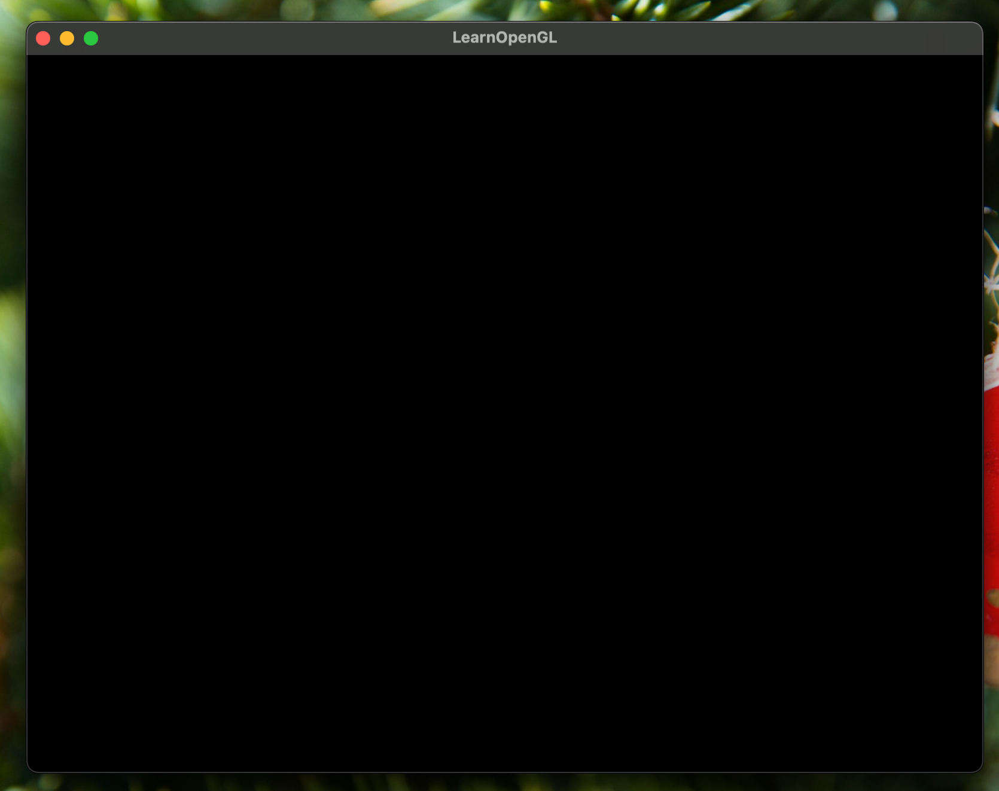
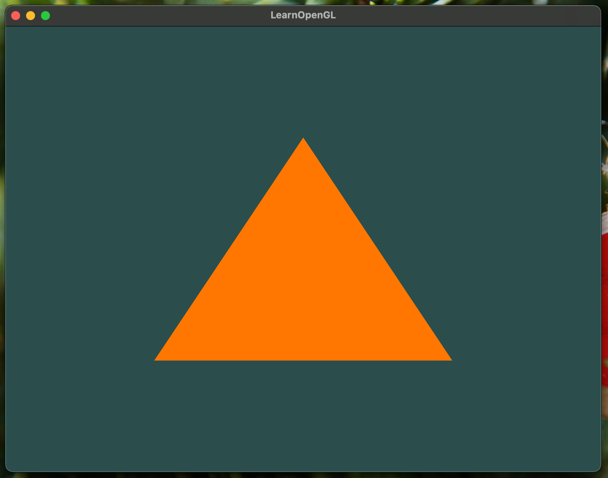
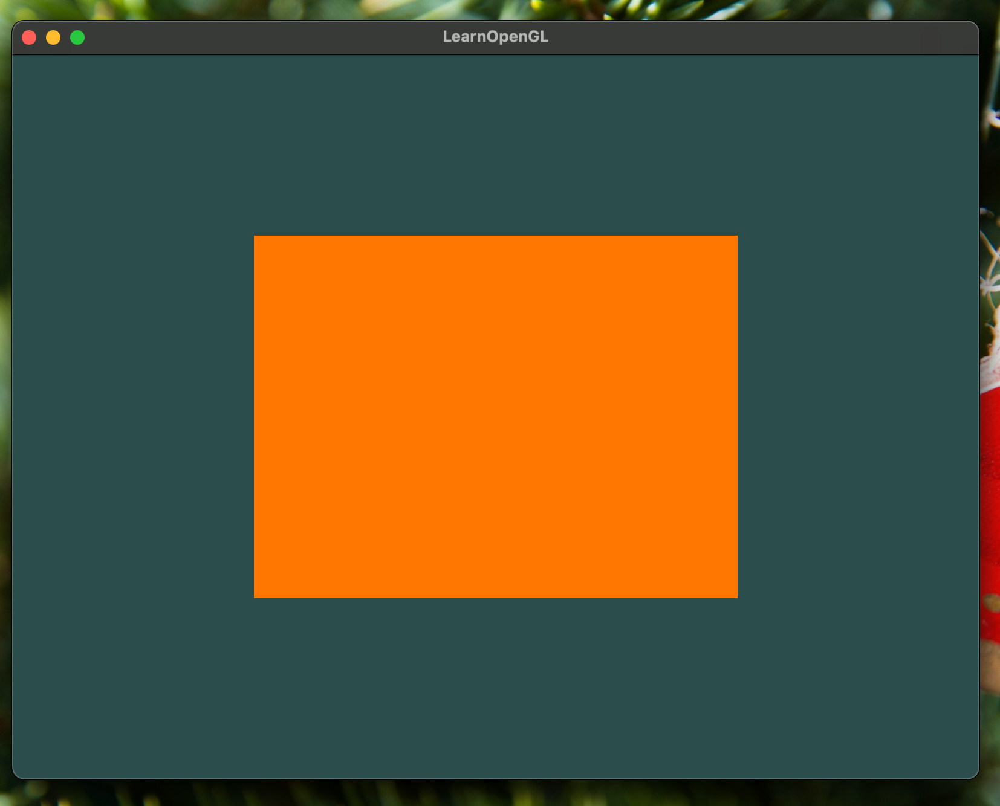

Two hours in and this is what I have:



## Getting started with Graphics Programming

Before we start, let's get some context on why I'm pivoting my career path ot graphics programming.

Contrary to popular belief, I don't think machine learning is overrated or web development market is saturated,
but I just want to try something new that could be related to user interfaces and front-end development.

Also, I am a visual learner (spoiler: everybody is a visual learner) and I think it would be fun to learn how to create
a game engine or a graphics library from scratch.

I'm using [LearnOpenGL](https://learnopengl.com) as my main resource to learn OpenGL.
I really want to use Rust but I'm not sure if I'm good enough to translate the C++ code to Rust.

## Setting up the environment

was a pain.

I didn't know how to link the libraries. All I know is `cargo add` and `cargo run`.
C++ is a different beast. So I became friends with `conan` and `cmake`.

uhh... let's say I became friends with only `conan`.

We only have to 

```py
class tinyglRecipe(ConanFile):
    # ...
    def requirements(self):
        self.requires("glfw/3.4")
        self.requires("glad/0.1.36")
    ## ...
```

and write some CMakeLists.txt

```cmake
cmake_minimum_required(VERSION 3.15)
project(tinygl VERSION 0.1)

// [!code highlight:3]
find_package(glfw3 REQUIRED)
find_package(glad REQUIRED)

add_executable(${PROJECT_NAME}
    src/main.cpp
)

// [!code highlight:5]
target_link_libraries(${PROJECT_NAME} PRIVATE
    glfw
    glad::glad
)

install(TARGETS ${PROJECT_NAME}
    RUNTIME DESTINATION bin
)
``` 

and we're good to go!

```sh
$ conan install . --build=missing
$ conan build .
$ 
```

## The code

I did not change the code from the tutorial at all, but basically this is what it does:

1. Set up the "hint" for the window and configure it with OpenGL 3.3
2. Create a window object
3. Initialize GLAD to load the OpenGL functions
4. Set the viewport size to 800x600
5. Register the callback to reset the viewport on resize
6. The main clears the screen and swaps the buffers then polls the events

[Here's the code](https://learnopengl.com/Getting-started/Hello-Window)

## Where triangle tho?

Alright, here's my first triangle:



The OpenGL code is divided into three parts:

1. Setting up the window (which we already did)
2. Shader sources and compilation
3. Vertex data and buffers

The shaders are also divided into two parts: vertex and fragment shaders.
Vertex shaders just put the vertices in the right place and fragment shaders color the pixels.
The GLSL code is pretty much like C but only syntax-wise.

Next we attach the shaders to the program and link them. Then we can delete the shader objects.

In the current code, we have a vertex array object (VAO) and a vertex buffer object (VBO). What's the different?
I'm imaginnig the VBO as a list of vertices and the VAO as a list of attribute pointers that point to the VBO.

We then can use VAOs to bind and draw the triangles in the main loop.

## VBO... and VAO... and EBO?

I'm imagining EBO as a list of indices that refer to already defined vertices. 
This is useful when we have overlapping vertices and we don't want to repeat the vertices.

especially when we have a rectangle



## So what's my take?

OpenGL has so many steps but I guess any graphics API would be quite similar.
I heard that OpenGL is on the easier side of the spectrum, so I guess I have to be patient.

Maybe I'm not used to the C++ syntax yet. They usually have a pattern of create a reference to the thing,
use the thing as and argument in a binding function, and then do stuff. Working with Rust has spoiled me
with a function being able to return a struct and then call a method on it.

For a polymorphism inside a function, they rely on using `TYPE_CONSTANT_INDICATOR` so that's another thing to get used to.

Also error handling is a bit different. We used to have `Result` and `Option` in Rust.
It's like doing `if err != nil` in Go but even more verbose.

I will stick to C++ for now and see how it goes, because if anything goes wrong, I can always
copy-paste the code and learn from the differences. If I complete the tutorial, I will try to
learn `wgpu` in Rust.