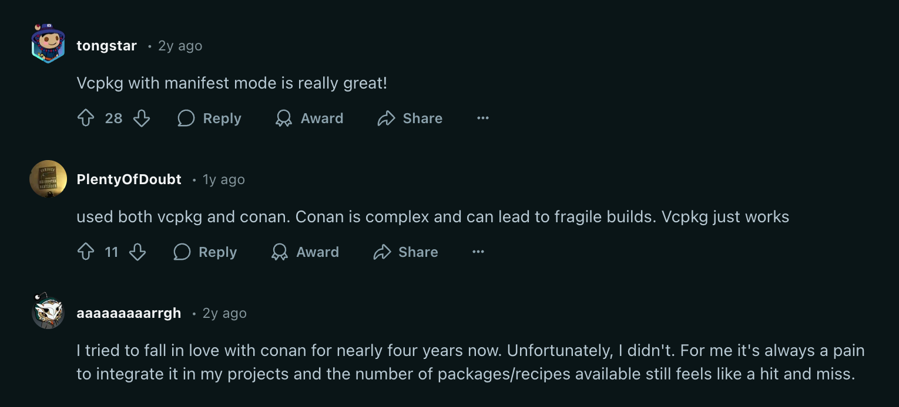
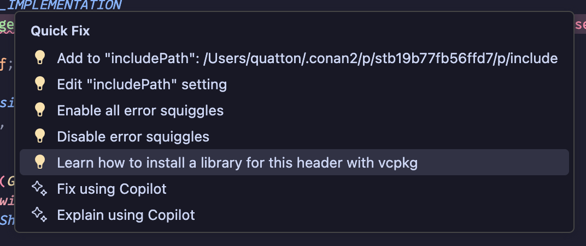
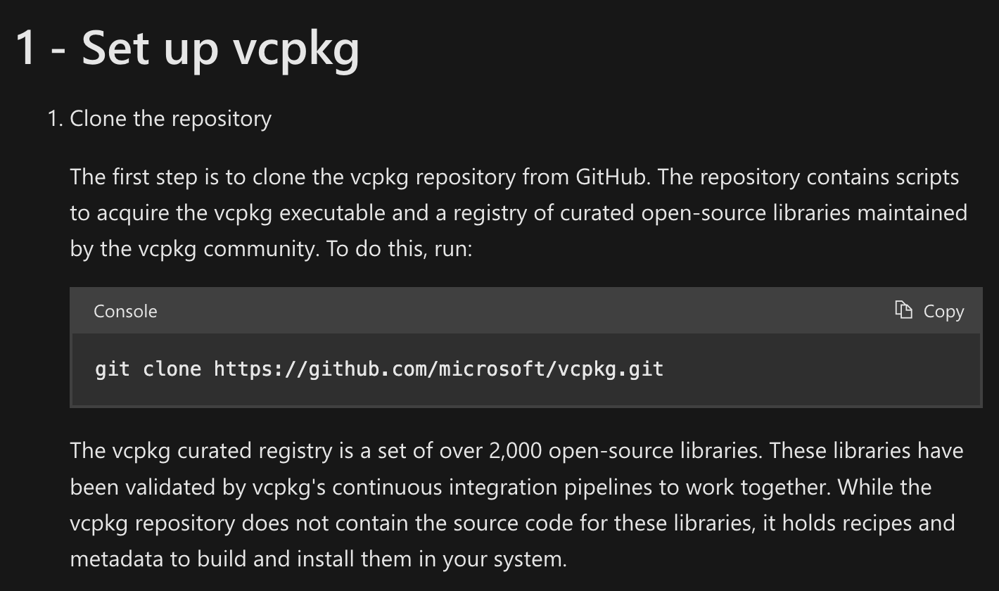
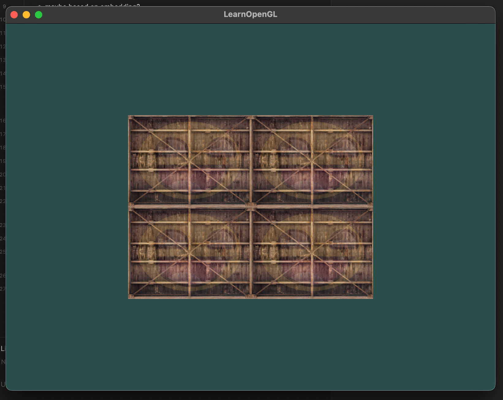

Conan was my choice for package manager for C++ projects. 
I thought it was the best because it came up first in the search results.

There were rough edges, at first I didn't know how to
1. Install the libraries
2. Link the libraries
3. Integrating with CMake... but that's not Conan's fault (I didn't know how to write a CMakeLists.txt)

And today I had to link `stb_image` which is a header-only library.
I thought it would be easy to just add it to the `requirements.txt` but it wasn't...

VSCode was complaining that it couldn't find the header file.
So I tried to use the `Quick Fix` feature but VSCode just straight up recommended me to use another package manager.



I was like what? Is that a thing? Is Conan that bad? And they we found the image above.

## Getting started

As a proud ✨Javascript Developer✨, not being able to `npm install -g bun` was a bummer.



> I can't install a new package manager with my old package manager??
> Microsoft, I thought you were used to people using Edge to download Chrome.

Jokes aside, I think I should get used to `git clone` and do things manually because C++
people does that a lot. 

But the installation is easy enough. We just have to run `bootstrap-vcpkg.bat` and done!
The vcpkg binary will appear in the directory.

Also, haha funny, Microsoft.

```
vcpkg on  master via 🐍 v3.12.2 (quatton) on ☁️  (ap-northeast-1) 
❯ ./bootstrap-vcpkg.sh
Downloading vcpkg-macos...
vcpkg package management program version 2025-01-24-874e302b1fa28cc81caefbb1483f80103c51ab52

See LICENSE.txt for license information.
Telemetry
---------
vcpkg collects usage data in order to help us improve your experience.
The data collected by Microsoft is anonymous.
You can opt-out of telemetry by re-running the bootstrap-vcpkg script with -disableMetrics,
passing --disable-metrics to vcpkg on the command line,
or by setting the VCPKG_DISABLE_METRICS environment variable.

Read more about vcpkg telemetry at docs/about/privacy.md

vcpkg on  master via 🐍 v3.12.2 (quatton) on ☁️  (ap-northeast-1) 
❯ ./bootstrap-vcpkg.sh --disable-metrics
Unknown argument --disable-metrics. Use '-help' for help.
```

Now we just add the path to the environment variables and we can use `vcpkg` from the command line.

```
tinygl on  main [!?⇡] via △ v3.31.0 via 🐍 v3.12.2 (quatton) on ☁️  (ap-northeast-1) 
❯ vcpkg --version
vcpkg package management program version 2025-01-24-874e302b1fa28cc81caefbb1483f80103c51ab52

See LICENSE.txt for license information.
```

## Migrating from Conan to vcpkg

First of all I removed `conanfile.py` and replace it with `vcpkg.json`.

```json
{
    "name": "tinygl",
    "version": "0.1",
    "dependencies": [
        "glfw",
        "glad",
        "stb",
        "glm"
    ]
}
```

And then just... follow the instructions.

Remember when we had Justfile?

```diff
-  conan install . --build=missing --settings build_type=Debug
+configure:
+  cmake --preset=default
 
 build:
-  conan build . --settings build_type=Debug
+  cmake -B build -G Ninja -DCMAKE_BUILD_TYPE=Debug -DCMAKE_TOOLCHAIN_FILE=${VCPKG_ROOT}/scripts/buildsystems/vcpkg.cmake .
 
-run:
+run: build
   ./build/tinygl
 
 clean:
```

I have modified it to not use Conan, but I guess it reallt doesn't matter because
I realized that I could've just build with `F7` in VSCode.

And... it should work...

## Day 2

Well, Day 2 is about

1. Writing shaders
2. Refactoring the shader compilation code into a class
3. Loading textures
4. Also I installed `glsl_analyzer` so now we have auto-completion for GLSL (and a formatter!)
5. State management and keyboard event

I wanna complete OpenGL as soon as possible so I can move on to `wgpu`
and now we will write stuff for web so I can use my blog as a playground!



For the state management part I thought I should create a variable inside main
and pass the reference to the process event function but it seems like it did not work.
I had to resort to using a global variable.

It seems like the keyboard press event runs multiple times when I hold a key.
I think it makes sense because it is just holds a state and we read it every frame,
not like a listener that listens to the event and triggers a callback.

That concludes Day 2. I will continue tomorrow.