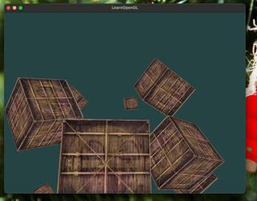

```cpp
int main() {
  AppBuilder config;
  config.setWindowSize(SCR_WIDTH, SCR_HEIGHT);
  config.setOpenGLVersion(3, 3);
  config.setWindowName("LearnOpenGL");

  App app = config.build();

  glm::vec3 cubePositions[] = {
      glm::vec3(0.0f, 0.0f, 0.0f),    glm::vec3(2.0f, 5.0f, -15.0f),
      glm::vec3(-1.5f, -2.2f, -2.5f), glm::vec3(-3.8f, -2.0f, -12.3f),
      glm::vec3(2.4f, -0.4f, -3.5f),  glm::vec3(-1.7f, 3.0f, -7.5f),
      glm::vec3(1.3f, -2.0f, -2.5f),  glm::vec3(1.5f, 2.0f, -2.5f),
      glm::vec3(1.5f, 0.2f, -1.5f),   glm::vec3(-1.3f, 1.0f, -1.5f)};

  for (int i = 0; i < 10; i++) {
    app->spawn(
        CubeObject(cubePositions[i],
                   (glm::quat)glm::rotate(glm::quat(1.0f, 0.0f, 0.0f, 0.0f),
                                          glm::radians(20.0f * i),
                                          glm::vec3(1.0f, 0.3f, 0.5f))));
  }

  app->run();

  return 0;
}
```

With an attempt to refactor the code into a builder pattern, 
I realized it's not as clean as I thought. But it's fine for now.

I am planning to refactor the inside of the `App` class into a more modular design.
containing `Shader`, `Texture`, `Model` (vertex buffer, vertex array, etc), and 
the abstract `Component` classes like Camera or Cube.

However, I ran into the biggest barrier of all: 
I cannot find a way to register a callback function using a member function of a class.
member function in C++ doesn't capture `this` and return a function pointer.

Hence the error:

```
Reference to non-static member function must be called
```

I look up on the internet and found out that I have to use `std::bind` but it seems like
for GLFW, it's not possible to use `std::bind` because it's a C library (💀!!)

The solution is? 

We define a `WindowUserPointer` and pass the `this` pointer to it.

```cpp
glfwSetWindowUserPointer(window, this);
```

Then we get the `this` pointer back in the callback function instead of
doing the reverse: capturing `this` into the callback function.

```cpp
glfwSetCursorPosCallback(window, [](GLFWwindow *w, double x, double y) {
  static_cast<App *>(glfwGetWindowUserPointer(w))->mouse_callback(w, x, y);
});
glfwSetScrollCallback(window, [](GLFWwindow *w, double x, double y) {
  static_cast<App *>(glfwGetWindowUserPointer(w))->scroll_callback(w, x, y);
});
```

And that's how you do it!

In my opinion it just feel like an elaborated global variable but it's fine for now.
Although we only have one instance of `App` and one instance of `Window`, doing this 
feels a bit overkill. but alr we ball.

## Camera doesn't move...

There is a very strange bug where the camera doesn't orbit (rotate) but does translate.
It seems like the value are being updated properly but the camera doesn't move.
The `front` vector of the camera in the event loop doesn't follow the updated value
for some reason.

I didn't expect this to be a bug until I actually log the _important values_ out.

Guess what's wrong with this code?

```cpp
App AppBuilder::build() {
  app.init();
  return app;
}

App app = config.build();
```

The `App` object is being copied instead of being referenced!
So the `.init()` that we called in the `build` function did init the `app` that belongs to the `config`

The returned app is also the `app` that belongs to the `config`. 
Only when you write it too `App app` it will be passed by value.

Hence, the callbacks that we registered stayed in the `config` object and not the copied `app` object.

The reason why translating still works because it triggers the function in the event loop
directly, not through registering a callback.

I have two choices which are:

Change to return by reference
```cpp
App *AppBuilder::build() {
  app.init();
  return &app;
}
```

or do not init in the `build` function
```cpp

App AppBuilder::build() {
  return app;
}

App app = config.build();
app.init();
```

In the future, I want to keep all the initialization in the `build` function.
So I will go with the first option.

## Day 3

Day 3 is about matrix transformation and camera.
Transformation is basically local -> world -> view -> projection. 
So a nested matrix multiplication.

Camera was heavy on the lookAt but `glm` has lookAt built in so nothing to worry about.

and yeah

