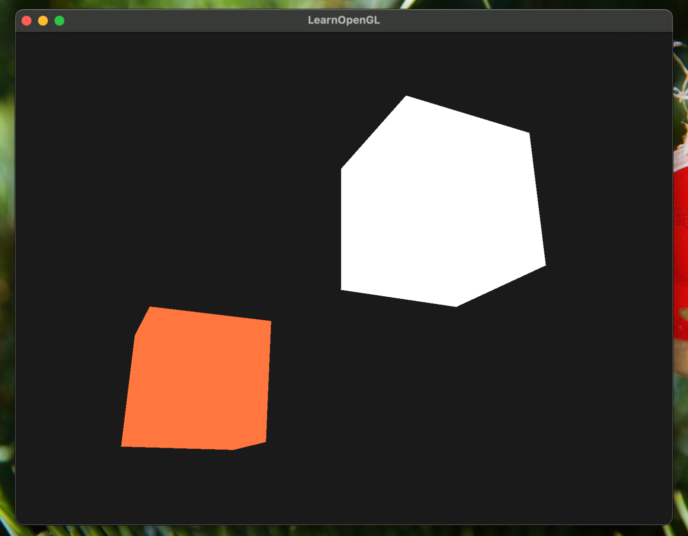

```cpp

int main() {
  auto app = PipelineBuilder()
                 .add_plugin<CameraPlugin>()
                 .add_plugin<RendererPlugin>()
                 .build();

  auto *rd = app->get_plugin<RendererPlugin>();
  auto ss = Shader("shaders/shader.vert", "shaders/shader.frag");
  auto ls = Shader("shaders/light.vert", "shaders/light.frag");

  rd->add_shader(ss);
  rd->add_shader(ls);

  auto cubeModel = CubeModel::create();
  auto lightModel = cubeModel.copy();
  rd->add_model(ss, cubeModel);
  rd->add_model(ls, lightModel);
  auto cube = Object(glm::vec3(0.0f, 0.0f, 0.0f));
  auto light = Object(glm::vec3(1.2f, 1.0f, 2.0f));
  rd->add_object(cubeModel, cube);
  rd->add_object(lightModel, light);
  rd->set_object_hook(cube, [](ObjectHookInput ctx) {
    ctx.shader.setVec3("objectColor", 1.0f, 0.5f, 0.31f);
    ctx.shader.setVec3("lightColor", 1.0f, 1.0f, 1.0f);
  });

  app->run();

  return 0;
}
```

We... finally did it. We have a pipeline that can register plugins.
The plugins can register models, shaders, and objects.

This is done by using a generic `PluginBase` class that has a `virtual void setup()` method
and a `virtual void update()` method. This is inspired by ECS (Entity-Component-System) architecture.
In the future we might want to add a way to register systems and components... and entity as well
because this is nothing like ECS.

I know that reflection (changing behavior i.e. adding systems and components at runtime) 
can be slower and more error-prone. Also meta programming in C++ is magic, unlike what
we are used to in Rust. But since it's a learning project (and I'm plannnig to ditch C++ soon),
I think it's fine for now.

## RendererPlugin

The `RendererPlugin` is a plugin that is responsible for rendering the scene. Yeah.. of course.

The `RendererContext` is a struct like this:

```cpp
struct RendererContext {
  std::map<unsigned int, std::reference_wrapper<Shader>> shaders;
  std::map<unsigned int, std::vector<std::reference_wrapper<Model>>>
      shader_models;
  std::map<unsigned int, std::vector<std::reference_wrapper<Object>>>
      model_objects;
  std::map<unsigned int, std::vector<std::function<void(ObjectHookInput)>>>
      object_hooks;
};
```

We had a wrapper class `Res<T>` that is a resource server that can store things like above,
but I ran into some issues with the difference in implementation so I just use `std::map` for now.

This is how you can register a shader

```cpp
void add_shader(Shader &s) const {
  ctx->shaders.emplace(s.ID, std::ref(s));
  ctx->shader_models.emplace(s.ID,
                              std::vector<std::reference_wrapper<Model>>());
}
```

So it just inserts the shader into the `shaders` map and creates an empty vector for the models.

Now we have hiearchy like this:
```
Shader
  Model
    Object
      Hook
``` 

So we can run a 4-level nested loop (which can be multi-threaded) to render the scene.
Ideally I would want to flatten this but I would like to render 1 shader, 1 model at a time
so in order to do that I have to keep the hierarchy.

## Adding plugins

This is how you can add a plugin:

```cpp
template <typename Plugin, typename... Args>
PipelineBuilder &add_plugin(Args &&...args) {
  plugins_.emplace_back(
      std::make_unique<Plugin>(std::forward<Args>(args)...));
  return *this;
}
```

It utilizes the so-called "variadic templates" which is a way to pass multiple arguments.
It's also what powers `std::make_unique` and `std::forward`, as you can see in the code above.
`...` is so amazing. I want the Pipeline to own the plugins so I use `std::unique_ptr`.

## The pain of premature optimization

The title of this article.

I have been modeling how the hierarchy would look like and how the data would flow.
The previous implementation did not account for how `Model` might share `VBO`s.
Also I did not think about the lifetime and ownership of the objects at all.
The same program in Rust would be screamed at multiple times by the borrow checker.

I wasted a lot of time trying to figure these out and I think I should've just
learn OpenGL not meta-programming in C++. But I guess it's a good learning experience.

Here is today's result:

