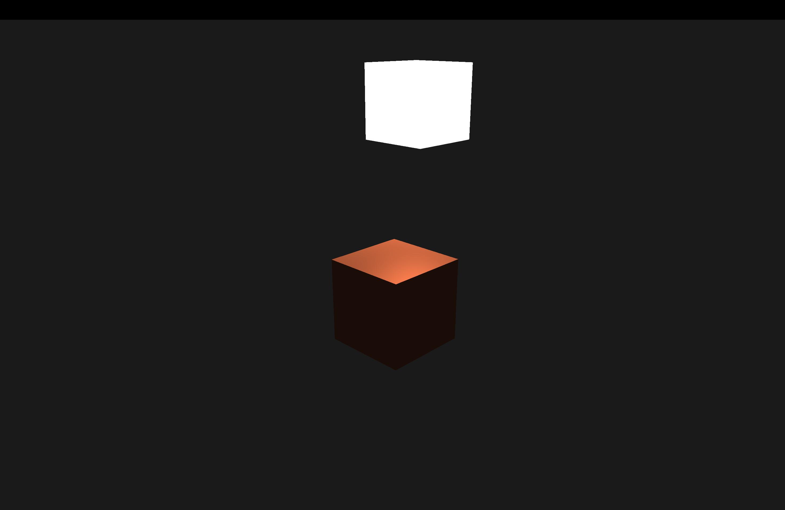
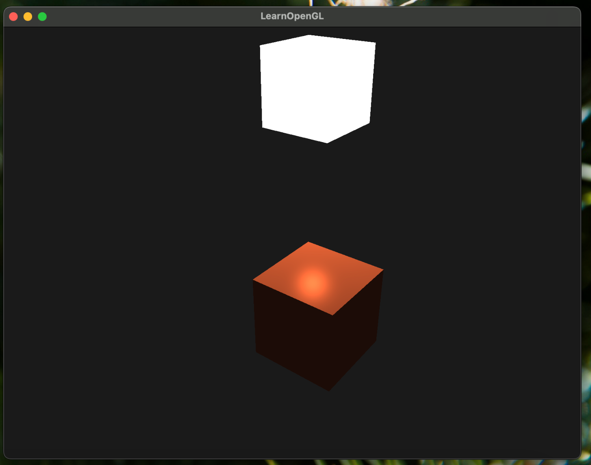

```cpp
void Camera::ProcessKeyboard(Camera_Movement direction, float deltaTime) {
  float velocity = MovementSpeed * deltaTime;
  if (direction == FORWARD) {
    Position += glm::normalize(Front - glm::dot(Front, Up) * Up) * velocity;
  }
  if (direction == BACKWARD) {
    Position -= glm::normalize(Front - glm::dot(Front, Up) * Up) * velocity;
  }
  if (direction == LEFT) {
    Position -= Right * velocity;
  }
  if (direction == RIGHT) {
    Position += Right * velocity;
  }
  if (direction == UP) {
    Position += Up * velocity;
  }
  if (direction == DOWN) {
    Position -= Up * velocity;
  }
}
```

I changed the process keyboard function to Minecraft-like movement.
Instead of 4-directional movement, I split the forward-backward movement into two directions: planal-forward and up.
Planal forward can be easily calculated by rejecting from the `Up` vector. (`glm`'s `unProject` function is 
surprisingly difficult to use, but my viewport and model matrix are simple enough to just subtract the dot product).

This gives me a more intuitive movement, especially when I need to go up while looking at the target object.

## Comment to my pipeline abstraction

In the previous chapter, we discussed about the plugin system of our render pipeline.
There are many inconveniences in the current system, but these are the most prominent ones:

1. Accessing the context of another plugin looks "expensive"

```cpp
ctx.shader.setVec3(
      "viewPos",
      ctx.pipeline.get_plugin<CameraPlugin>()->ctx->camera->Position);
```

The method above is used to get the camera position in the object hook.
It has to go through the pipeline to get the camera plugin, then get the camera object from the plugin.
I wonder how Bevy elegantly solves this by having systems automatically receive their required dependencies 
through dependency injection. The `App` automatically injects the parameters when registering systems. 
This is a really useful pattern I'd like to implement.


2. Object hook is not flexible due to having access of only one object

Both cube shader and light shader are using `lightPos` but I had
to create two `lightPos` variables per each object. This could potentially lead
to inconsistency if I forget to update one of them.

```cpp
rd->set_object_hook(cube, [](ObjectHookInput ctx) {
  auto t = glfwGetTime();
  auto lightPos = glm::vec3(sin(t), 0.0f, cos(t));
  ctx.shader.setVec3("lightPos", lightPos);
});

rd->set_object_hook(light, [](ObjectHookInput ctx) {
  auto t = glfwGetTime();
  ctx.object.position = glm::vec3(sin(t), 0.0f, cos(t));
});
```

I think this can be solved by the same method as the first problem.
I wish we had a `Query` system like Bevy, but I still have no idea how to implement it in C++.
Well, in Rust as well but at least I have a reference to look at.

## Day 5 Result



So in Day 5 we added Phong lighting to our pipeline.
It consists of three components: ambient, diffuse, and specular lighting.

ambient is basically a constant light.
diffuse is the angle between light and normal vector.
specular is the angle between the reflection vector and the view vector.

I spin the light around the cube to show the specular lighting.
Here is another image where I make the specular lighting more prominent.

