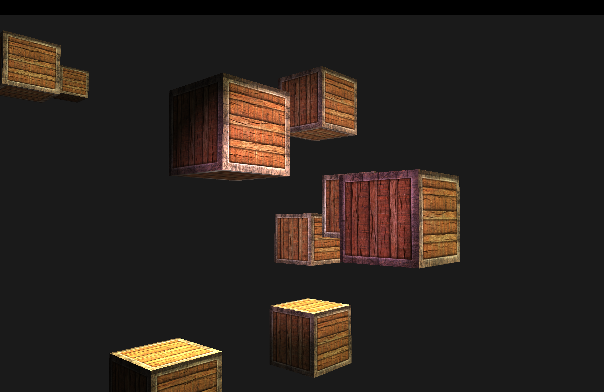
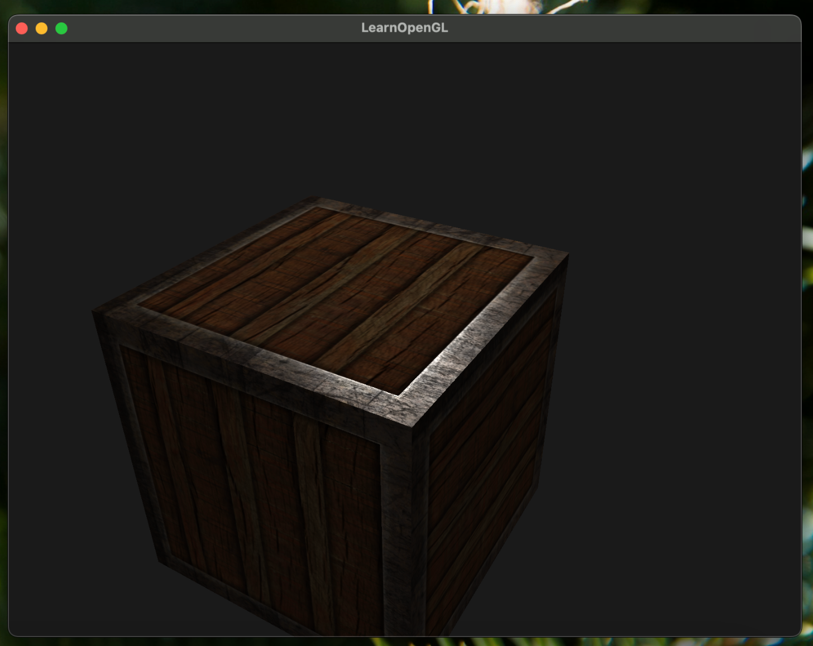
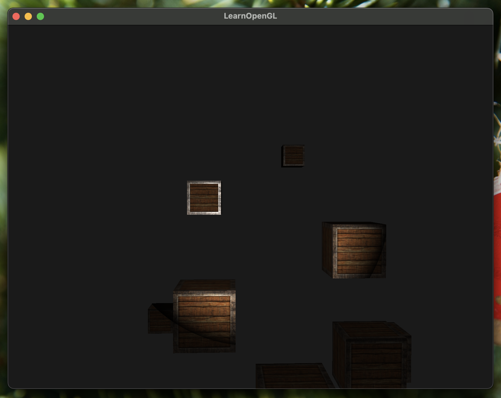

## Material

I did not dare to abstract the material property for my render pipeline.
The most I did was simply a builder pattern for `TextureLoader`

```cpp
auto containerTexture = TextureLoader()
                              .from_path("textures/container2.png")
                              .set_wrap_s(Wrap::REPEAT)
                              .set_wrap_t(Wrap::REPEAT)
                              .set_min_filter(MinFilter::LINEAR_MIPMAP_LINEAR)
                              .set_mag_filter(MagFilter::NEAREST)
                              .load();
```

Not only does texture "put image on the object", but we can also sample
the texture to get specular and diffuse maps.



That looks really cool to me.

## Multiple lighting

We implemented 3 types of lighting

1. Pointlight - Distance matters
2. Directional Light - All rays are parallel
3. Spotlight - Pointlight with cutoff

I like spotlight the most. It's like a flashlight.



And yeah, that was pretty much it for today.
